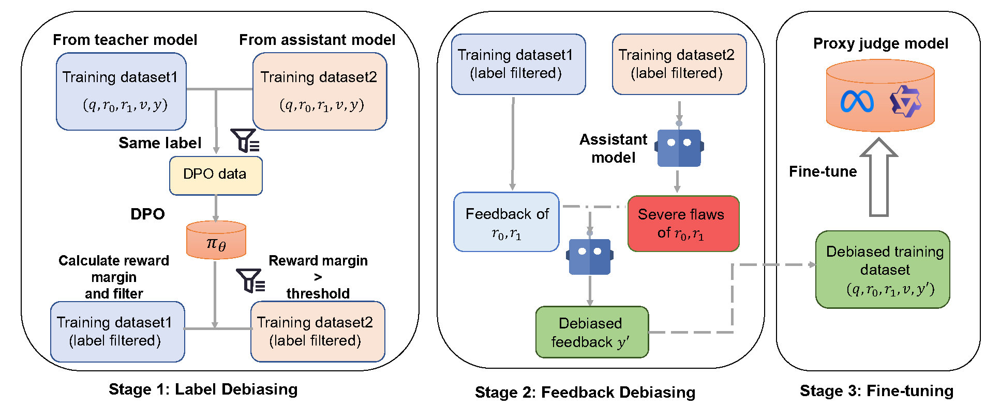

# [EMNLP 2025]Assistant-Guided Mitigation of Teacher Preference Bias in LLM-as-a-Judge

Code for the paper **Assistant-Guided Mitigation of Teacher Preference Bias in LLM-as-a-Judge**

<p align="center">
  
</p>

### Structure
```
AGD
├── convert.py # A tool for transforming dataset format
├── data
│   ├── gpt4_vs_other.json # Teacher preference bias evaluation on MT-Bench
│   ├── OffsetBias.json # Teacher preference bias evaluation on OffsetBias
│   └── pairwise_traindata.json # Raw AutoJ-pairwise training dataset
├── data_process
├── dpo.sh
├── sft.sh
├── benchmark.sh 
├── evaluation
│   ├── evaluate_acc.py
│   └── evaluate_bias.py
├── IFD
├── judge_utils
├── README.md
├── requirement.txt
└── src
```
## Get Started

```
conda create -n AGD python=3.10
conda activate AGD
pip install -r requirements.txt
```
### Generate Dataset

Using a closed-source large model such as the GPT-3.5-Turbo API:
Write your `OPENAI_API_KEY` in the environment variable.
```
python data_process/generate_raw_training_dataset.py \
    --model gpt-3.5-turbo \
    --dataset_path ./data/pairwise_traindata.json \
    --output_path ./data/pairwise_traindata_gpt3.5_raw.json
```
For open-source LLM such as Qwen2.5-7B-Instruct:

```
CUDA_VISIBLE_DEVICES=0 python data_process/generate_raw_training_dataset.py \
    --model /path/to/your/assistant_model \
    --dataset_path ./data/pairwise_traindata.json \
    --output_path ./data/pairwise_traindata_qwen_raw.json \
    --open_source
```

### Filter
Filter out those labels which is TIE or failed to parse.
```
python data_process/filter_tie.py \
    --dataset_path ./data/pairwise_traindata.json \
    --output_path ./data/pairwise_traindata_gpt4_wo_tie.json

python data_process/filter_tie.py \
    --dataset_path ./data/pairwise_traindata_gpt3.5_raw.json \
    --output_path ./data/pairwise_traindata_gpt3.5_wo_tie.json
```
Prepare dpo data
```
python data_process/data_process_dpo.py \
    --data_path1 ./data/pairwise_traindata.json \
    --data_path2 ./data/pairwise_traindata_gpt3.5_raw.json \
    --output_path ./data/dpo_train.jsonl \
    --num_samples 1000
```

### DPO
We perform DPO based on the [ms-swift](https://github.com/modelscope/ms-swift).
We have already written the script `dpo.sh`.

```
bash dpo.sh
```

### Calculate implicit reward margin

calculate loss and ppl
``` 
# reference model
CUDA_VISIBLE_DEVICES=0 python IFD/ifd.py \
    --dataset_path ./data/pairwise_traindata_gpt4_wo_tie.json \
    --save_path ./data/sft_llama_gpt4_ppl.jsonl \
    --model_name /path/to/your/reference_model

# target model
CUDA_VISIBLE_DEVICES=0 python IFD/ifd.py \
    --dataset_path ./data/pairwise_traindata_gpt4_wo_tie.json \
    --save_path ./data/dpo_llama_gpt4_ppl.jsonl \
    --model_name /path/to/your/target_model
```
calculate implicit reward margin
```
python IFD/sampler.py \
    --dpo_ppl_path ./data/dpo_llama_gpt4_ppl.jsonl \
    --sft_ppl_path ./data/sft_llama_gpt4_ppl.jsonl \
    --input_path ./data/pairwise_traindata_gpt4_wo_tie.json \
    --output_path ./data/pairwise_traindata_gpt4_wo_tie_margin.json
```

### Refine feedback

Filter dataset by implicit reward margin and select those with same label.
```
python data_process/filter_margin.py \
    --teacher_dataset_raw ./data/pairwise_traindata.json \
    --assistant_dataset_raw ./data/pairwise_traindata_gpt3.5_raw.json \
    --teacher_dataset_margin ./data/pairwise_traindata_gpt4_wo_tie_margin.json \
    --assistant_dataset_margin ./data/pairwise_traindata_gpt3.5_wo_tie_margin.json \
    --threshold 5 \
    --output_path ./data/filtered_margin_same_label.json
```

Generate flaws of the responses by assistant model:
```
# For closed-source LLM such as GPT-3.5-Turbo:
python data_process/generate_critique.py \
    --model gpt-3.5-turbo \
    --dataset_path ./data/filtered_margin_same_label.json \
    --output_path ./data/critique.json

# For open-source LLM such as Qwen2.5
python data_process/generate_critique.py \
    --model /path/to/your/assistant_model \
    --dataset_path ./data/filtered_margin_same_label.json \
    --output_path ./data/critique.json \
    --open_source \
    --model_name qwen-7b-chat
```

Combining flaws and feedback to generate refined feedbacks:
```
# For closed-source LLM such as GPT-3.5-Turbo:
python data_process/generate_refined_feedback.py \
    --model gpt-3.5-turbo \
    --dataset_path ./data/critique.json \
    --output_path ./data/filtered_margin_same_label_out.json

# For open-source LLM such as Qwen2.5
python data_process/generate_refined_feedback.py \
    --model /path/to/your/assistant_model \
    --dataset_path ./data/critique.json \
    --output_path ./data/filtered_margin_same_label_out.json \
    --open_source \
    --model_name qwen-7b-chat
```

### SFT

Merge and prepare the final datasets
```
python data_process/generate_final_dataset.py \
    --teacher_dataset_raw ./data/pairwise_traindata.json \
    --assistant_dataset_raw ./data/pairwise_traindata_gpt3.5_raw.json \
    --teacher_dataset_margin ./data/pairwise_traindata_gpt4_wo_tie_margin.json \
    --assistant_dataset_margin ./data/pairwise_traindata_gpt3.5_wo_tie_margin.json \
    --threshold 5 \
    --add_dataset_path ./data/filtered_margin_same_label_out.json\
    --output_path ./data/sft.jsonl
```

Fine-tune
```
bash sft.sh
```

### Evaluation

#### Evaluation Acc
Evaluation accuracy on standard benchmarks and OffsetBias

```
bash benchmark.sh
```
Due to space limitations, only the OffsetBias test dataset is provided as an example in the data directory. For other benchmarks, please download and transform their format manually refer to the dataset format in `evaluation/evaluate_acc.py`.
#### Evaluation Bias on MT-Bench
Evaluation win rate of GPT-4 vs others
```
CUDA_VISIBLE_DEVICES=0 python evaluation/evaluate_bias.py --model /path/to/your/proxy_judge_model
```

### Citation
If you find AGDe-Judge useful, please cite using this BibTeX:
```
@misc{liu2025assistantguidedmitigationteacherpreference,
      title={Assistant-Guided Mitigation of Teacher Preference Bias in LLM-as-a-Judge}, 
      author={Zhuo Liu and Moxin Li and Xun Deng and Qifan Wang and Fuli Feng},
      year={2025},
      eprint={2505.19176},
      archivePrefix={arXiv},
      primaryClass={cs.CL},
      url={https://arxiv.org/abs/2505.19176}, 
}
```
